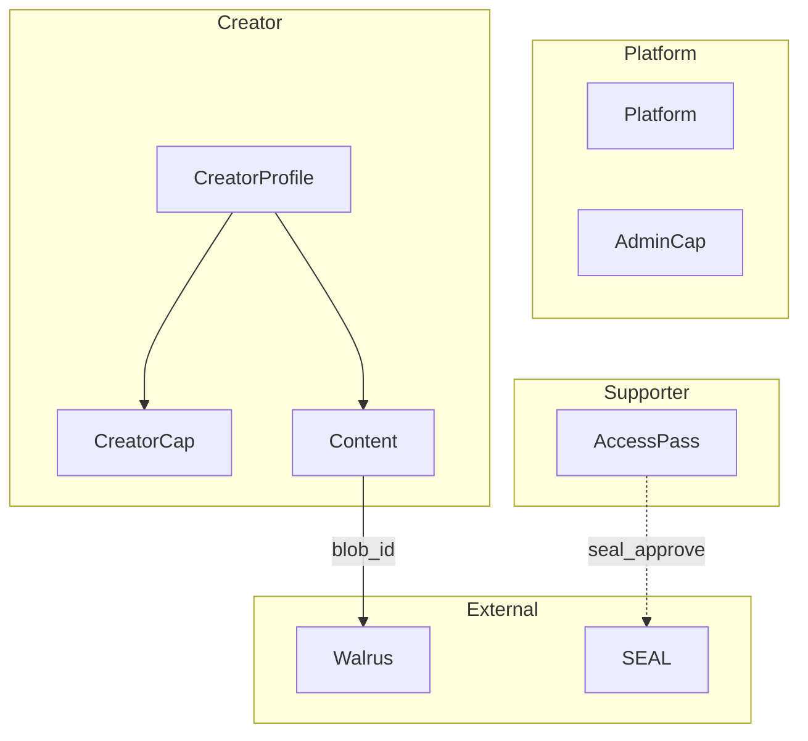

# SuiPatron — Data Flow and Domain Model

**Purpose:** Domain model, events, and data flows for SuiPatron. Shared language for product, engineering, and PRPs.  
**Reference:** [SCOPE.md](../SCOPE.md) Sections 3–4, [architecture/ARCHITECTURE-DESIGN.md](../architecture/ARCHITECTURE-DESIGN.md)

---

## Entities (On-Chain)

| Entity | Description | Ownership |
|--------|-------------|-----------|
| **Platform** | Singleton shared object: admin, total_creators, total_access_passes | Shared |
| **CreatorProfile** | Creator metadata: name, bio, avatar_blob_id, price, balance, content_count, total_supporters | Shared |
| **Content** | Per-content metadata: title, description, blob_id, content_type, created_at | Dynamic field on CreatorProfile |
| **CreatorCap** | Proves ownership of CreatorProfile; required for update_profile, publish_content, withdraw | Owned by creator |
| **AccessPass** | NFT proving supporter paid for access; used by seal_approve for decrypt | Owned by supporter |
| **AdminCap** | Platform admin operations | Owned by deployer |

---

## Value Objects

| Value | Description | Used In |
|-------|-------------|---------|
| **Price** | u64 in MIST | CreatorProfile |
| **BlobId** | Walrus blob identifier (string) | Content, avatar |
| **ContentType** | "image", "text", "pdf" | Content |
| **SEAL Identity** | 32 bytes = CreatorProfile ID | SEAL encrypt/decrypt |

---

## Capabilities

| Capability | Holder | Purpose |
|------------|--------|---------|
| **AdminCap** | Deployer | migrate, platform admin |
| **CreatorCap** | Creator | update_profile, publish_content, withdraw_earnings |

---

## Domain Events (On-Chain)

| Event | Meaning | Consumers |
|-------|---------|-----------|
| **ProfileCreated** | New creator profile | Indexer, Explore |
| **ProfileUpdated** | Profile metadata changed | Indexer |
| **ContentPublished** | New content added | Indexer, Creator Profile |
| **AccessPurchased** | Supporter paid, AccessPass minted | Indexer, useMyAccessPasses |
| **EarningsWithdrawn** | Creator withdrew balance | Indexer |

---

## Data Flows

### Sign In
```
User → Google OAuth → Enoki → zkLogin address created
```

### Create Profile
```
Frontend → buildCreateProfileTx(name, bio, price) → PTB bytes
→ POST /api/sponsor → Enoki sponsors → SUI executes
→ ProfileCreated event → Indexer (optional)
```

### Upload Content
```
File → SEAL encrypt(identity=creatorProfileId) → encrypted blob
→ Walrus upload → blobId
→ buildPublishContentTx(profileId, capId, title, desc, blobId, type)
→ POST /api/sponsor → Enoki → SUI executes
→ ContentPublished event
```

### Purchase Access
```
Supporter → buildPurchaseAccessTx(profileId, price, paymentCoin)
→ POST /api/sponsor → Enoki → SUI executes
→ AccessPass minted to supporter
→ AccessPurchased event
```

### View Content
```
Supporter → has AccessPass for creator
→ Walrus download(blobId) → encrypted blob
→ SEAL decrypt (seal_approve validates AccessPass on-chain)
→ Render (image/text/PDF)
```

### Withdraw Earnings
```
Creator → buildWithdrawTx(profileId, creatorCapId)
→ POST /api/sponsor → Enoki → SUI executes
→ Balance transferred to creator
→ EarningsWithdrawn event
```

---

## High-Level Domain Diagram


